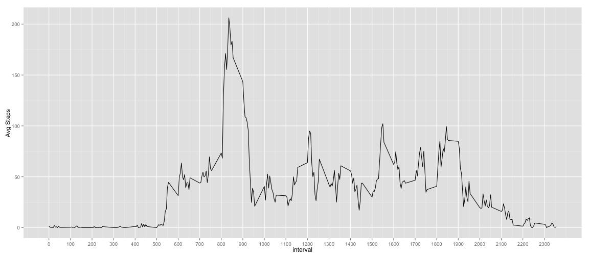
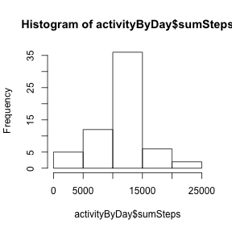

## Loading and preprocessing the data
First, I'll create a function to handle reading a single csv from a zip file,
and following that, I'll read the CSV to a dataset called activity, and finally 
print a summary. 

```r
readZipCSV <- function(zipFilePath, ...){
   # Function extracts a csv file in a zip file assuming the same name. 
   # Get the file name without extension
   fileNameNoExt = gsub(pattern = "(.*)\\..*$", "\\1", basename(zipFilePath))
   read.csv(unz(zipFilePath, paste(fileNameNoExt, ".csv", sep="")))
   }
activity = readZipCSV("./activity.zip", row.names=null)
summary(activity)
```

```
##      steps                date          interval     
##  Min.   :  0.00   2012-10-01:  288   Min.   :   0.0  
##  1st Qu.:  0.00   2012-10-02:  288   1st Qu.: 588.8  
##  Median :  0.00   2012-10-03:  288   Median :1177.5  
##  Mean   : 37.38   2012-10-04:  288   Mean   :1177.5  
##  3rd Qu.: 12.00   2012-10-05:  288   3rd Qu.:1766.2  
##  Max.   :806.00   2012-10-06:  288   Max.   :2355.0  
##  NA's   :2304     (Other)   :15840
```


## What is mean total number of steps taken per day?
To get the mean total number of steps per day, first I need to aggregate up my 
data set from the day+interval grain to the day grain, summing the steps by
day. [Granularity][1] of data is a term and concept from dimensional modeling. 
[Hadley Wickham][2] is an R boss, no two ways about it. He created a favorite R 
package of mine, called [dplyr][3]. dplyr provides a grammar of data manipulation, 
similar to the way the [ggplot2][4] package (also created by Hadley Wickham) 
provides a grammar of graphics. The key to using dplyr is the chaining operator 
denoted as '%>%', which allows one to write very complex, yet still readable 
chains of data operations. I'll use it here to summarize my data to the day 
grain and then take the mean by day.

[1]:http://www.kimballgroup.com/2003/03/declaring-the-grain/ "Granularity"
[2]:http://had.co.nz "Hadley Wickham"
[3]:http://cran.rstudio.com/web/packages/dplyr/vignettes/introduction.html "dplyr"
[4]:http://ggplot2.org "ggplot2"


```r
suppressMessages(library(dplyr))
activityByDay <- activity %>%
                     group_by(date) %>%
                     summarize(
                        sumSteps=sum(steps)
                     ) %>%
                     select(date, sumSteps)

activityByDay
```

```
## Source: local data frame [61 x 2]
## 
##          date sumSteps
## 1  2012-10-01       NA
## 2  2012-10-02      126
## 3  2012-10-03    11352
## 4  2012-10-04    12116
## 5  2012-10-05    13294
## 6  2012-10-06    15420
## 7  2012-10-07    11015
## 8  2012-10-08       NA
## 9  2012-10-09    12811
## 10 2012-10-10     9900
## 11 2012-10-11    10304
## 12 2012-10-12    17382
## 13 2012-10-13    12426
## 14 2012-10-14    15098
## 15 2012-10-15    10139
## 16 2012-10-16    15084
## 17 2012-10-17    13452
## 18 2012-10-18    10056
## 19 2012-10-19    11829
## 20 2012-10-20    10395
## 21 2012-10-21     8821
## 22 2012-10-22    13460
## 23 2012-10-23     8918
## 24 2012-10-24     8355
## 25 2012-10-25     2492
## 26 2012-10-26     6778
## 27 2012-10-27    10119
## 28 2012-10-28    11458
## 29 2012-10-29     5018
## 30 2012-10-30     9819
## 31 2012-10-31    15414
## 32 2012-11-01       NA
## 33 2012-11-02    10600
## 34 2012-11-03    10571
## 35 2012-11-04       NA
## 36 2012-11-05    10439
## 37 2012-11-06     8334
## 38 2012-11-07    12883
## 39 2012-11-08     3219
## 40 2012-11-09       NA
## 41 2012-11-10       NA
## 42 2012-11-11    12608
## 43 2012-11-12    10765
## 44 2012-11-13     7336
## 45 2012-11-14       NA
## 46 2012-11-15       41
## 47 2012-11-16     5441
## 48 2012-11-17    14339
## 49 2012-11-18    15110
## 50 2012-11-19     8841
## 51 2012-11-20     4472
## 52 2012-11-21    12787
## 53 2012-11-22    20427
## 54 2012-11-23    21194
## 55 2012-11-24    14478
## 56 2012-11-25    11834
## 57 2012-11-26    11162
## 58 2012-11-27    13646
## 59 2012-11-28    10183
## 60 2012-11-29     7047
## 61 2012-11-30       NA
```
Now that I've got a data table at the day grain, I can show a couple of 
hisorgrams from different plotting systems of the new sumSteps column/variable.  

```r
suppressMessages(library(ggplot2))
qplot(sumSteps, data=activityByDay, binwidth=2500)
```

 

```r
hist(activityByDay$sumSteps)
```

 
  
Finally, I'll take a look at the mean an median of the summarized-by-day 
dataset.

```r
activityByDay %>%
   summarize(meanOfDays=mean(sumSteps, na.rm=TRUE),
             medianOfDays=median(sumSteps, na.rm=TRUE))
```

```
## Source: local data frame [1 x 2]
## 
##   meanOfDays medianOfDays
## 1   10766.19        10765
```


## What is the average daily activity pattern?
For the next step, I need the data at the interval grain, with the measurement 
summarized via an average by time interval across all days for the same time
interval. I will use the amazing dplyr again. Once I summarize the data to the 
desired grain, I'll plot a time series line graph of the data, and we can get a
sense of the which time intervals are on average the most active.

```r
activityByInterval <- activity %>%
                        group_by(interval) %>%
                        summarize(meanSteps=mean(steps, na.rm=TRUE))

ggplot(activityByInterval, aes(interval, meanSteps)) +
   geom_line() + ylab("Avg Steps") +
   scale_x_continuous(breaks=seq(min(activityByInterval$interval), 
                                 max(activityByInterval$interval), 
                                 by=100
                              )
                      )
```

 
From the above figure, you can see that by far the most active time of the day 
from the given data is between 8am and 9am, right about 8:15am almost.    
Let's find out for sure which interval has the highest.


```r
activityByInterval[which(activityByInterval$meanSteps ==
                            max(activityByInterval$meanSteps)
                         ),
                   c("interval")]
```

```
## [1] 835
```
So, it's actually around 8:35am. Sorting the data by descending meanSteps, 
we can see the same thing.

```r
activityByInterval %>%
   arrange(desc(meanSteps))        
```

```
## Source: local data frame [288 x 2]
## 
##    interval meanSteps
## 1       835  206.1698
## 2       840  195.9245
## 3       850  183.3962
## 4       845  179.5660
## 5       830  177.3019
## 6       820  171.1509
## 7       855  167.0189
## 8       815  157.5283
## 9       825  155.3962
## 10      900  143.4528
## ..      ...       ...
```
## Imputing missing values
In this section, we'll handle missing values. First, lets get a sense of the
scope of the problem.

```r
nrow(activity[is.na(activity$steps), ])
```

```
## [1] 2304
```
A simple strategy for imputing missing values might be to fill them in with the
average for the given interval. We can use our average by interval dataset from 
earlier.

```r
activityWithMeans <- left_join(activity, activityByInterval, by="interval")
idxNa = which(is.na(activityWithMeans$steps))
activityWithMeans[idxNa, ]$steps = round(activityWithMeans[idxNa, ]$meanSteps)
activityWithMeans <- activityWithMeans[, c("steps", "date", "interval")]
summary(activityWithMeans)
```

```
##      steps                date          interval     
##  Min.   :  0.00   2012-10-01:  288   Min.   :   0.0  
##  1st Qu.:  0.00   2012-10-02:  288   1st Qu.: 588.8  
##  Median :  0.00   2012-10-03:  288   Median :1177.5  
##  Mean   : 37.38   2012-10-04:  288   Mean   :1177.5  
##  3rd Qu.: 27.00   2012-10-05:  288   3rd Qu.:1766.2  
##  Max.   :806.00   2012-10-06:  288   Max.   :2355.0  
##                   (Other)   :15840
```
Now we can take the mean and median and plot a histogram again.

```r
activityByDay <- activityWithMeans %>%
                     group_by(date) %>%
                     summarize(
                        sumSteps=sum(steps)
                     ) %>%
                     select(date, sumSteps)
qplot(sumSteps, data=activityByDay, binwidth=2500)
```

 

```r
hist(activityByDay$sumSteps)
```

 

```r
activityByDay %>%
   summarize(meanOfDays=mean(sumSteps, na.rm=TRUE),
             medianOfDays=median(sumSteps, na.rm=TRUE))
```

```
## Source: local data frame [1 x 2]
## 
##   meanOfDays medianOfDays
## 1   10765.64        10762
```
It looks like the imputation of the data did not really affect the mean or 
median very much, and it did not affect the shape of the histogram. It did 
increase the total count of days that make up the "center" mean portion of the 
histogram. 
## Are there differences in activity patterns between weekdays and weekends?
Now, I'll do some analysis on the differences between weekends and weekdays.

```r
activity$weekendInd = factor(
                        gsub("Monday|Tuesday|Wednesday|Thursday|Friday", "Weekday", 
                           gsub("Sunday|Saturday", "Weekend", weekdays(as.Date(activity$date)))
                        )
                     )

activityByInterval <- activity %>%
                        group_by(weekendInd, interval) %>%
                        summarize(meanSteps=mean(steps, na.rm=TRUE))

ggplot(activityByInterval, aes(interval, meanSteps)) +
   geom_line() + ylab("Avg Steps") +
   scale_x_continuous(breaks=seq(min(activityByInterval$interval), 
                                 max(activityByInterval$interval), 
                                 by=100
                              )
                      ) +
   facet_grid(weekendInd ~ .)
```

 
There is a similar spike of steps from 8am-9am on the weekend as there is on 
weekdays, but it's also clear that weekend steps are higher throughout the rest
of the day.
